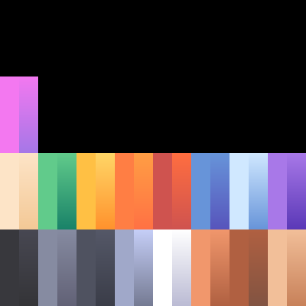

# ⚔️ Pirate P2P - Bataille Navale 3D Cartoon

Jeu multijoueur 3D en **Peer-to-Peer (WebRTC)** dans un style cartoon, créé avec les assets officiels **[Kenney Pirate Kit](https://kenney.nl/assets/pirate-kit)** et propulsé par **Three.js** et **Vite**.



---

## 🎮 Fonctionnalités

- **Multijoueur Peer-to-Peer (WebRTC)** :
  - Connexion directe de navigateur à navigateur via **PeerJS** sans serveur de jeu centralisé.
  - Système de salon avec code de partage (ex: `PIRATE-XXXX`) et lien d'invitation directe (`?room=PIRATE-XXXX`).
  - Synchronisation en temps réel (30 Hz) : positions, orientations, roulis/tangage, tirs de canons, dégâts et butin.
- **Mode Solo vs Flottes Pirates IA** :
  - Jouable immédiatement sans attendre d'adversaire !
  - Navires ennemis autonomes avec détection de cibles, patrouilles et manoeuvres tactiques de bordée.
- **Modèles 3D Kenney Pirate Kit** :
  - Plusieurs navires jouables avec statistiques uniques :
    - 🏴‍☠️ **Galion Pirate** : Équilibré (100 PV, 3 canons/bordée).
    - 👑 **Brigantin Royal** : Maniable et rapide (100 PV).
    - ⚡ **Sloop Léger** : Ultra rapide (80 PV).
    - 👻 **Hollandais Volant** : Navire fantôme renforcé (120 PV).
  - Décors d'archipel tropical : îles de sable, palmiers, falaises rocheuses, tours de garde, forteresses, épaves et jetées.
- **Physique Navale & Océan Cartoon** :
  - Océan stylisé avec déformation de vagues en vertex shader et calcul CPU en temps réel.
  - Flottaison dynamique : tangage et roulis synchronisés avec la houle, inclinaison lors des virages serrés.
  - Écume de sillage et vagues à l'étrave.
- **Combat & Balistique** :
  - Tirs de bordée Bâbord (gauche) et Tribord (droite) avec délais décalés réalistes.
  - Volée complète de canons avec fumée volumétrique cartoon, flammes de départ de coup et recul du navire.
  - Effets d'éclats de bois, projections d'eau lors des tirs manqués et secousses d'écran.
  - Ramassage d'épaves : **Coffres au trésor** (+50 Or) et **Barils de rhum** (+35 PV de réparation).
- **Effets Sonores Procéduraux (Web Audio API)** :
  - Détonations de canons percutantes, sifflements, éclaboussures marines, impacts sur bois, cloche de navire et fanfares.
  - 100% autonome, zéro dépendance externe, zéro erreur 404.

---

## 🕹️ Commandes de Jeu

| Action | Clavier (AZERTY & QWERTY) | Souris |
| :--- | :--- | :--- |
| **Hisser les voiles / Avancer** | `Z` / `W` / `Flèche Haut` | - |
| **Affaler les voiles / Reculer** | `S` / `Flèche Bas` | - |
| **Gouvernail Bâbord (Gauche)** | `Q` / `A` / `Flèche Gauche` | - |
| **Gouvernail Tribord (Droite)** | `D` / `Flèche Droite` | - |
| **Bordée Bâbord (Gauche)** | `F` ou `X` | `Clic Gauche` (ou bouton HUD) |
| **Bordée Tribord (Droite)** | `E` ou `C` | `Clic Droit` (ou bouton HUD) |
| **Double Bordée (Bâbord & Tribord)** | `ESPACE` | Bouton central HUD |
| **Contrôle de Caméra** | - | Maintenir le clic & glisser / Molette pour zoomer |
| **Messages / Émotes rapides** | `1`, `2`, `3`, `4` | Boutons d'émotes en bas à gauche |

---

## 🚀 Installation & Développement Local

```bash
# Cloner le dépôt
git clone https://github.com/Okiosk/PirateP2P.git
cd PirateP2P

# Installer les dépendances
npm install

# Lancer le serveur de développement
npm run dev

# Compiler pour la production (dossier dist/)
npm run build
```

---

## 🌐 Déploiement sur GitHub Pages

Le projet inclut un workflow GitHub Actions automatisé dans `.github/workflows/deploy.yml`.

Pour activer le déploiement automatique :
1. Sur votre dépôt GitHub, allez dans **Settings** > **Pages**.
2. Dans **Build and deployment** > **Source**, sélectionnez **GitHub Actions**.
3. Tout `push` sur la branche `main` compilera et déploiera automatiquement le jeu à l'adresse :
   `https://<username>.github.io/PirateP2P/`

---

## 📜 Crédits & Licence

- **Assets 3D** : [Kenney Pirate Kit](https://kenney.nl/assets/pirate-kit) sous licence **CC0 1.0 Universal (Public Domain)**.
- **Code & Moteur** : Licence MIT.
